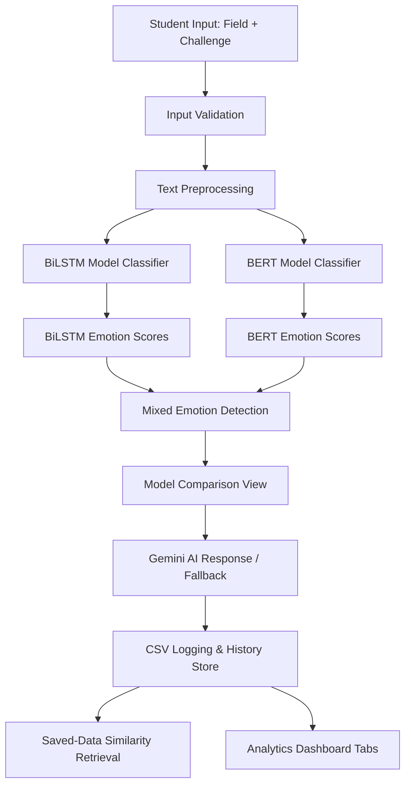

# System Architecture Diagram

This diagram displays how user input is processed, classified by the models, integrated with LLM response, logged to CSV history, and visualized on the dashboard.

```mermaid
graph TD
    Student[Student Input: Field + Challenge] --> Val[Input Validation]
    Val --> Prep[Text Preprocessing]
    Prep --> BiLSTM[BiLSTM Model Classifier]
    Prep --> BERT[BERT Model Classifier]
    BiLSTM --> Scores1[BiLSTM Emotion Scores]
    BERT --> Scores2[BERT Emotion Scores]
    Scores1 --> Mixed[Mixed Emotion Detection]
    Scores2 --> Mixed
    Mixed --> Comp[Model Comparison View]
    Comp --> Gemini[Gemini AI Response / Fallback]
    Gemini --> CSV[CSV Logging & History Store]
    CSV --> Similarity[Saved-Data Similarity Retrieval]
    CSV --> Dashboard[Analytics Dashboard Tabs]
```
