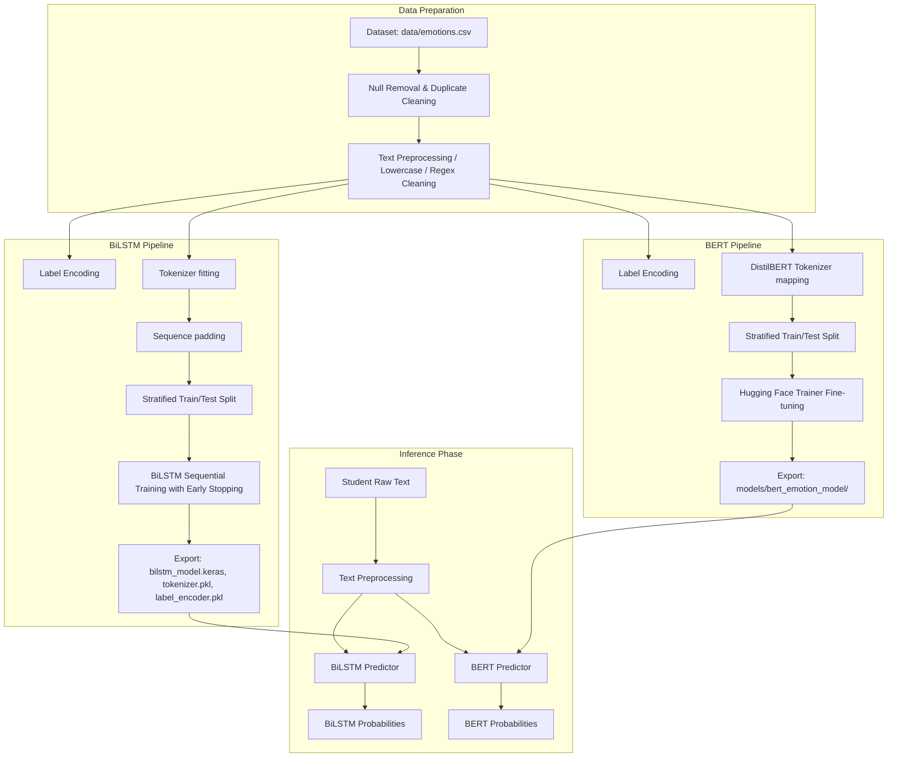

# Machine Learning Training and Inference Pipeline

The ML pipeline outlines the datasets, preprocessing, training, evaluation, saving, and inference phases.

```mermaid
graph TD
    subgraph Data Preparation
        D[Dataset: data/emotions.csv] --> C[Null Removal & Duplicate Cleaning]
        C --> P[Text Preprocessing / Lowercase / Regex Cleaning]
    end

    subgraph BiLSTM Pipeline
        P --> Enc1[Label Encoding]
        P --> Tok1[Tokenizer fitting]
        Tok1 --> Pad1[Sequence padding]
        Pad1 --> Split1[Stratified Train/Test Split]
        Split1 --> Train1[BiLSTM Sequential Training with Early Stopping]
        Train1 --> Save1[Export: bilstm_model.keras, tokenizer.pkl, label_encoder.pkl]
    end

    subgraph BERT Pipeline
        P --> Enc2[Label Encoding]
        P --> Tok2[DistilBERT Tokenizer mapping]
        Tok2 --> Split2[Stratified Train/Test Split]
        Split2 --> Train2[Hugging Face Trainer Fine-tuning]
        Train2 --> Save2[Export: models/bert_emotion_model/]
    end

    subgraph Inference Phase
        RawText[Student Raw Text] --> InfPrep[Text Preprocessing]
        InfPrep --> InfBiLSTM[BiLSTM Predictor]
        InfPrep --> InfBERT[BERT Predictor]
        Save1 --> InfBiLSTM
        Save2 --> InfBERT
        InfBiLSTM --> Scores1[BiLSTM Probabilities]
        InfBERT --> Scores2[BERT Probabilities]
    end
```
