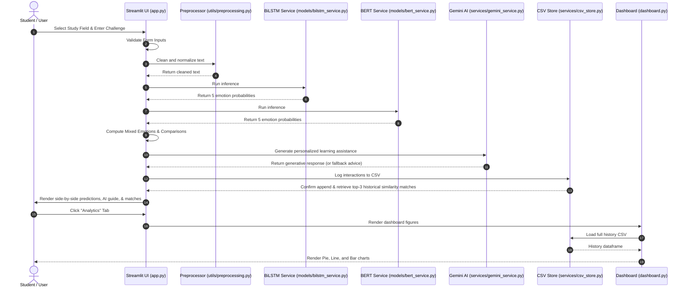

# End-to-End Sequence Diagram

The sequence diagram displays the flow of information across components for a single user challenge submission.

```mermaid
sequenceDiagram
    autonumber
    actor Student as Student / User
    participant UI as Streamlit UI (app.py)
    participant Prep as Preprocessor (utils/preprocessing.py)
    participant BiLSTM as BiLSTM Service (models/bilstm_service.py)
    participant BERT as BERT Service (models/bert_service.py)
    participant Gemini as Gemini AI (services/gemini_service.py)
    participant CSV as CSV Store (services/csv_store.py)
    participant Dash as Dashboard (dashboard.py)

    Student->>UI: Select Study Field & Enter Challenge
    UI->>UI: Validate Form Inputs
    UI->>Prep: Clean and normalize text
    Prep-->>UI: Return cleaned text
    UI->>BiLSTM: Run inference
    BiLSTM-->>UI: Return 5 emotion probabilities
    UI->>BERT: Run inference
    BERT-->>UI: Return 5 emotion probabilities
    UI->>UI: Compute Mixed Emotions & Comparisons
    UI->>Gemini: Generate personalized learning assistance
    Gemini-->>UI: Return generative response (or fallback advice)
    UI->>CSV: Log interactions to CSV
    CSV-->>UI: Confirm append & retrieve top-3 historical similarity matches
    UI->>Student: Render side-by-side predictions, AI guide, & matches
    Student->>UI: Click "Analytics" Tab
    UI->>Dash: Render dashboard figures
    Dash->>CSV: Load full history CSV
    CSV-->>Dash: History dataframe
    Dash-->>Student: Render Pie, Line, and Bar charts
```
